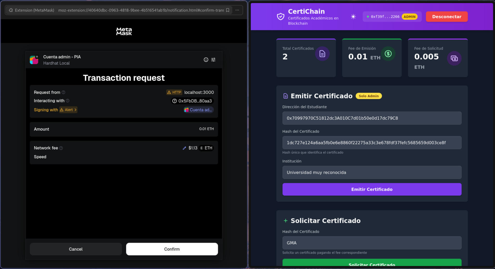
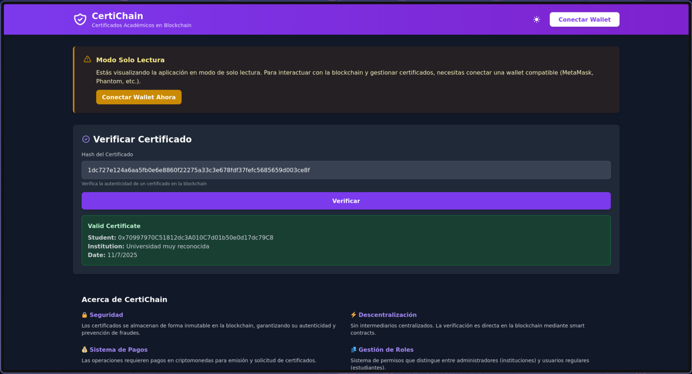

# CertiChain

Sistema descentralizado de certificados académicos construido con Ethereum, Go y JavaScript vanilla.

## Tabla de Contenidos

- [Descripción](#descripción)
- [Características](#características)
- [Arquitectura](#arquitectura)
- [Estructura del proyecto](#estructura-del-proyecto)
- [Requisitos previos](#requisitos-previos)
- [Instalación y ejecución](#instalación-y-ejecución)
  - [Usando Docker (recomendado)](#usando-docker-recomendado)
  - [Configuración de MetaMask](#configuración-de-metamask)
- [Cuentas de desarrollo](#cuentas-de-desarrollo)
- [Uso](#uso)
  - [Emitir un certificado (solo administradores)](#emitir-un-certificado-solo-administradores)
  - [Solicitar un certificado (cualquier usuario)](#solicitar-un-certificado-cualquier-usuario)
  - [Verificar un certificado (sin autenticación)](#verificar-un-certificado-sin-autenticación)
- [API Backend](#api-backend)
- [Smart Contract](#smart-contract)
  - [Funciones principales](#funciones-principales)
  - [Eventos](#eventos)
- [Showcase](#showcase)
- [Problemas conocidos](#problemas-conocidos)
- [Desarrollo](#desarrollo)
- [Tecnologías utilizadas](#tecnologías-utilizadas)
- [Seguridad](#seguridad)

## Descripción

CertiChain es una plataforma blockchain que permite a instituciones educativas emitir, verificar y gestionar certificados académicos de forma inmutable y transparente. Los certificados se almacenan en la blockchain de Ethereum, garantizando su autenticidad y prevención de fraude.

## Características

- **Emisión de certificados**: Los administradores pueden emitir certificados vinculados a direcciones de estudiantes
- **Verificación pública**: Cualquier usuario puede verificar la autenticidad de un certificado sin necesidad de autenticación
- **Solicitud de certificados**: Los estudiantes pueden solicitar la emisión de certificados mediante el pago de una tarifa

## Arquitectura

El proyecto utiliza una arquitectura de tres capas:

- **Smart Contract (Solidity)**: Lógica de negocio y almacenamiento en blockchain
- **Backend (Go)**: API REST para información del contrato y estado de la blockchain
- **Frontend (JavaScript)**: Interfaz web para interactuar con el contrato mediante MetaMask

## Estructura del proyecto

```
├── docker-compose.yml
├── docker-entrypoint.sh
├── Dockerfile
├── README.md
├── resources
│   ├── emision_certificado.jpg
│   └── verificar_certificado.jpg
└── src
    ├── backend
    │   ├── go.mod
    │   └── main.go
    ├── contract
    │   ├── contract.sol
    │   ├── deploy.js
    │   ├── hardhat.config.js
    │   └── package.json
    └── frontend
        ├── app.js
        ├── index.html
        ├── package.json
        └── styles.css
```

## Requisitos previos

- Docker y Docker Compose
- MetaMask (extensión de navegador)

## Instalación y ejecución

### Usando Docker (recomendado)

1. Clonar el repositorio:
```bash
git clone https://github.com/m0r4a/PIA-BlockChain.git
cd PIA-BlockChain
```

2. Construir y levantar los servicios:
```bash
docker-compose up --build
```

3. Acceder a la aplicación:
   - Frontend: http://localhost:3000
   - Backend API: http://localhost:8080
   - Blockchain RPC: http://localhost:8545

> [!NOTE]
> Realmente lo único que se debería usar es el Frontend.

### Configuración de MetaMask

1. Agregar red local de Hardhat:
   - Nombre de red: Hardhat Local
   - RPC URL: http://localhost:8545
   - Chain ID: 31337
   - Símbolo: ETH

2. Importar cuenta de desarrollo:
   - Usar cualquiera de las cuentas de prueba listadas abajo
   - La cuenta #0 tiene permisos de administrador por defecto

## Cuentas de desarrollo

Hardhat proporciona 10 cuentas precargadas con 10,000 ETH cada una:

| Cuenta | Dirección | Clave Privada | Rol |
|--------|-----------|---------------|-----|
| #0 | `0xf39Fd6e51aad88F6F4ce6aB8827279cffFb92266` | `0xac0974bec39a17e36ba4a6b4d238ff944bacb478cbed5efcae784d7bf4f2ff80` | Administrador |
| #1 | `0x70997970C51812dc3A010C7d01b50e0d17dc79C8` | `0x59c6995e998f97a5a0044966f0945389dc9e86dae88c7a8412f4603b6b78690d` | Usuario |
| #2 | `0x3C44CdDdB6a900fa2b585dd299e03d12FA4293BC` | `0x5de4111afa1a4b94908f83103eb1f1706367c2e68ca870fc3fb9a804cdab365a` | Usuario |
| #3 | `0x90F79bf6EB2c4f870365E785982E1f101E93b906` | `0x7c852118294e51e653712a81e05800f419141751be58f605c371e15141b007a6` | Usuario |
| #4 | `0x15d34AAf54267DB7D7c367839AAf71A00a2C6A65` | `0x47e179ec197488593b187f80a00eb0da91f1b9d0b13f8733639f19c30a34926a` | Usuario |
| #5 | `0x9965507D1a55bcC2695C58ba16FB37d819B0A4dc` | `0x8b3a350cf5c34c9194ca85829a2df0ec3153be0318b5e2d3348e872092edffba` | Usuario |
| #6 | `0x976EA74026E726554dB657fA54763abd0C3a0aa9` | `0x92db14e403b83dfe3df233f83dfa3a0d7096f21ca9b0d6d6b8d88b2b4ec1564e` | Usuario |
| #7 | `0x14dC79964da2C08b23698B3D3cc7Ca32193d9955` | `0x4bbbf85ce3377467afe5d46f804f221813b2bb87f24d81f60f1fcdbf7cbf4356` | Usuario |
| #8 | `0x23618e81E3f5cdF7f54C3d65f7FBc0aBf5B21E8f` | `0xdbda1821b80551c9d65939329250298aa3472ba22feea921c0cf5d620ea67b97` | Usuario |
| #9 | `0xa0Ee7A142d267C1f36714E4a8F75612F20a79720` | `0x2a871d0798f97d79848a013d4936a73bf4cc922c825d33c1cf7073dff6d409c6` | Usuario |

> [!NOTE]
> La cuenta #0 es la única con permisos de administrador inicialmente. Las demás cuentas funcionan como usuarios normales.

> [!TIP]
> Para cambiar de cuenta tienes que darle al menú de arriba a la derecha tipo hamburguesa, darle a `All permissions` o `Todos los permisos` y en `localhost:3000` podrás ver y cambiar la cuenta.

## Uso

### Emitir un certificado (solo administradores)

1. Conectar MetaMask con la cuenta #0
2. Completar el formulario de emisión:
   - Dirección del estudiante (puedes usar una de las otras cuentas de ejemplo)
   - Hash del certificado (identificador único, realmente puede ser cualquier texto)
   - Nombre de la institución
3. Aprobar la transacción (tarifa: 0.01 ETH)

### Solicitar un certificado (cualquier usuario)

1. Conectar MetaMask con cualquier cuenta
2. Ingresar el hash del certificado deseado
3. Aprobar la transacción (tarifa: 0.005 ETH)

> [!NOTE]
> Esto realmente no hace nada más que cobrarte, masomenos como el SAT, pero es como una prueba de concepto de que realmente te cobra y se hace la transacción.

### Verificar un certificado (sin autenticación)

1. No es necesario conectar wallet
2. Ingresar el hash del certificado
3. El sistema mostrará la información si el certificado existe

## API Backend

El backend expone los siguientes endpoints:

- `GET /health` - Health check del servidor
- `GET /api/contract/address` - Obtener dirección del contrato desplegado
- `GET /api/blockchain/block` - Número de bloque actual
- `GET /api/certificates/verify/{hash}` - Verificar certificado (mock)
- `GET /api/certificates/count` - Contador de certificados (mock)

**Nota**: Las operaciones de lectura/escritura del contrato se realizan directamente desde el frontend mediante ethers.js.

## Smart Contract

### Funciones principales

- `issueCertificate(address, string, string)` - Emitir certificado (payable, solo admin)
- `requestCertificate(string)` - Solicitar certificado (payable)
- `verifyCertificate(string)` - Verificar existencia y datos de certificado (view)
- `addAdmin(address)` - Agregar administrador (solo owner)
- `removeAdmin(address)` - Remover administrador (solo owner)
- `updateFees(uint256, uint256)` - Actualizar tarifas (solo owner)
- `withdrawFunds()` - Retirar fondos acumulados (solo owner)

### Eventos

- `CertificateIssued` - Emitido al crear un certificado
- `CertificateRequested` - Emitido al solicitar un certificado
- `AdminAdded` - Nuevo administrador agregado
- `AdminRemoved` - Administrador removido
- `FeesUpdated` - Tarifas actualizadas
- `FundsWithdrawn` - Fondos retirados del contrato

## Showcase

### Emitiendo un certificado

<p align="center">
    
</p>

### Verificando un certificado

<p align="center">
    
</p>

## Problemas conocidos

### MetaMask no detecta la red local

En algunos casos, MetaMask puede tener problemas para conectarse a la red local de Hardhat. En el caso de que esto suceda:

1. Desactivar la extensión de MetaMask en el navegador
2. Reactivar la extensión
3. Intentar conectarse nuevamente

Si el problema persiste:

1. Eliminar la red Hardhat Local de MetaMask
2. Reiniciar el navegador
3. Agregar nuevamente la red con los parámetros correctos

### Nonce incorrecto después de reiniciar la blockchain

Si reinicia los contenedores de Docker, la blockchain local se resetea pero MetaMask mantiene el historial de transacciones. Esto puede causar errores de nonce. Solución:

1. Ir a Configuración de MetaMask > Avanzado
2. Hacer clic en "Restablecer cuenta"
3. Confirmar la acción

## Desarrollo

### Ejecutar sin Docker

#### Backend
```bash
cd src/backend
go mod tidy
go run main.go
```

#### Frontend
```bash
cd src/frontend
npm install
npx http-server -p 3000
```

#### Blockchain
```bash
cd src/contract
npm install
npx hardhat node
npx hardhat run deploy.js --network localhost
```

## Tecnologías utilizadas

- **Blockchain**: Hardhat, Solidity 0.8.19
- **Backend**: Go 1.21, gorilla/mux, go-ethereum
- **Frontend**: JavaScript vanilla, ethers.js 6.x, Tailwind CSS
- **Infraestructura**: Docker, Docker Compose

## Seguridad

Este proyecto es solo para la universidad, desconozco cualquier posible vulnerabilidad pequeña o grande que haya introducido, por favor JAMÁS expongas ninguna de estas apps al internet.
